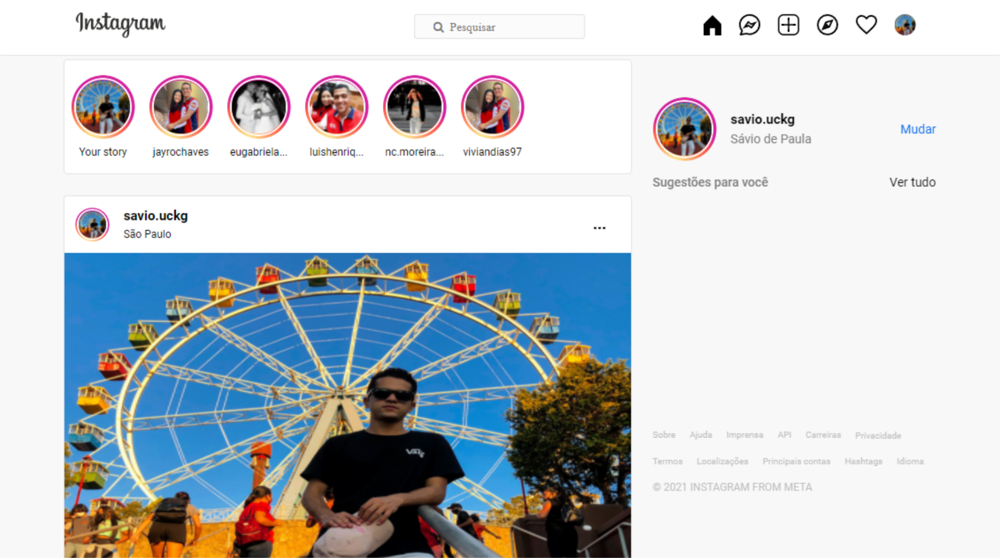

<h1 align="center">
  
</h1>

  <a href="#-tecnologias">Tecnologias</a>&nbsp;&nbsp;&nbsp;|&nbsp;&nbsp;&nbsp;
  <a href="#-projeto">Projeto</a>&nbsp;&nbsp;&nbsp;|&nbsp;&nbsp;&nbsp;
  <a href="#-contribuição">Contribuição</a>

 

  

## 🚀 Tecnologias

Esse projeto foi desenvolvido com as seguintes tecnologias:

- HTML
- CSS

## 💻 Projeto

Ui clone da home page do instagram.

## 🤝 Contribuição

Contribuições são o que fazem pessoas evoluirem e incentivam a melhorar, inspirar e criar. Qualquer contribuição que você fizer será **muito apreciada**.

1. Faça um Fork do projeto
2. Crie uma Branch para sua Feature (`git checkout -b feature/FeatureIncrivel`)
3. Adicione suas mudanças (`git add .`)
4. Comite suas mudanças (`git commit -m 'Adicionando uma Feature incrível!`)
5. Faça o Push da Branch (`git push origin feature/FeatureIncrivel`)
6. Abra uma Pull Request

<!-- CONTACT -->
---
## Contato

Feito com ♥ by Sávio de Paula - [Github](thub.com/savio-fju) - **saviofju@gmail.com**

